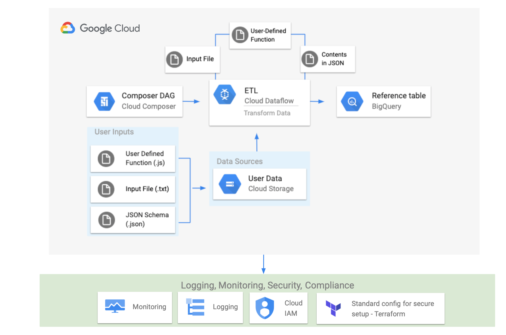

# Cloud Composer

This sandbox will deploy a [Cloud Composer](https://cloud.google.com/composer)

List of the components used in this sandbox:

* [`Network`](https://github.com/agilestacks/google-components/tree/main/gke-gcloud)
* [`Cloud Composer Environment`](https://github.com/agilestacks/google-components/tree/main/composer-environment)
* [`Dataflow Pipeline Example`](https://github.com/agilestacks/google-components/tree/main/dataflow-example)
* [`Cloud Storage Bucket`](https://github.com/agilestacks/google-components/tree/main/dataflow-example)
* [`BigQuery Table`](https://github.com/agilestacks/google-components/tree/main/dataflow-example)

> Note: additional details are available in [Cloud Composer Guide](https://cloud.google.com/composer/docs/how-to)

## Configuration

Before you can deploy the sandbox please run the initialization command pointing to the `hub` manifest file:

```shell
hub stack init -f "hub-composer-demo-app.yaml"
hub stack configure
```

You will be prompted for Composer version - use values `v1` or `v2`. Read more about configuration options here: https://cloud.google.com/composer/docs/how-to/managing/creating

The following additional parameters can be modified in `hub-composer-demo-app.yaml` file

| Name      | Description | Default Value |
| :-------- | :--------   | :-------- |
| `gke.nodeCount` | Number of GKE nodes for compose environment. Must be at least `3` | `3` |
| `gke.machineType` | Number of GKE nodes for compose environment | `n1-standard-1` | 
| `composer.version` | Version of composer (`v1` or `v2`) when `v2` | `v1` |
| `component.network.subnetworkCidr` | Target environment subnet address range | `10.127.0.0/20` |


## Deployment

Once you are done with the configuration, use the following command to deploy a sandbox

```shell
hub stack deploy
```

If you want to change environemnt configuration and redeploy a composer environment run following command

```
hub stack undeploy -c "composer"
# make a change  now in the configuration or in the body of the component
hub stack deploy -c "composer"
```

> Note: ieven in minimal configuration it will still take 20+ minutes to redeploy


To delete the sandbox, run the followng command:

```
hub stack undeploy
```

## Getting deployment result

After successful deployment you will get three URLs

1. Airflow URL
2. GCS bucket 
3. GKE Cluster

You can also find it by running command:

```bash
hub show
```

If you want to see only the configuration parameters used by Composer run the following command

```
hub show -c "composer"
```

### Get GKE kubeconfig

Use a query string for 

```bash
cluster_name="$(hub show -q '.parameters.composer.gkeCluster' -- -Mr)"
gcloud container clusters get-credentials "$cluster_name"

# to confirm cluster setup
k cluster-info
```

TODO: we may want to delegate this to the `composer` component `post-deploy`. Depends if we bother to deploy on top anything else, (i.e. Ingress Controller, user apps etc as set of components)

## See also

* [Cloud Composer Guide](https://cloud.google.com/composer/docs/how-to)
* [Creating Environment](https://cloud.google.com/composer/docs/how-to/managing/creating)

## Architecture Diagram



